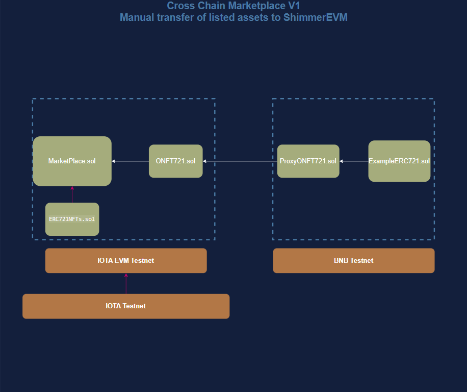

# ISC-Cross-Chain-NFT-Marketplace
This is an NFT marketplace, where NFTs are listed on IOTA Testnet, IOTA EVM Testnet and BNB Testnet. 

#### This tutorial is separated in 3 parts:
##### Part I: Build an NFT market place on IOTA EVM Testnet, which only supports NFT on the same chain.

##### Part II: List NFTs bridged from IOTA Testnet L1, and BNB Testnet.

##### Part III: Deploy the NFT marketplace on BNB Testnet, making the NFT marketplace contract handle cross-chain transactions.

Current Architecture:

